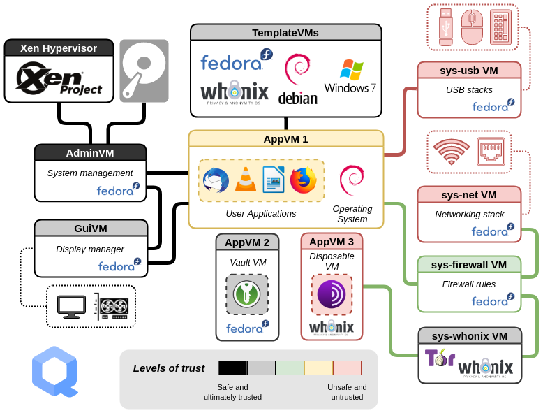

[**Qubes OS**](../desktop.md#qubes-os) is an open-source operating system which uses the [Xen](https://en.wikipedia.org/wiki/Xen) hypervisor to provide strong security for desktop computing through isolated virtual machines. 每个虚拟机被称为 *Qube* ，你可以根据它的目的给每个Qube分配一个信任等级。 As Qubes OS provides security by using isolation, and only permitting actions on a per-case basis, it is the opposite of [badness enumeration](https://www.ranum.com/security/computer_security/editorials/dumb/).

## Qubes操作系统是如何工作的？

Qubes使用 [分区](https://www.qubes-os.org/intro/) ，以保持系统的安全性。 Qubes是由模板创建的，默认的是Fedora、Debian和 [Whonix](../desktop.md#whonix)。 Qubes OS还允许你创建一次使用的 [一次性的](https://www.qubes-os.org/doc/how-to-use-disposables/) 虚拟机。

<figcaption>Qubes架构，信用：什么是Qubes操作系统介绍</figcaption>

每个Qubes应用程序都有一个 [色的边框](https://www.qubes-os.org/screenshots/) ，可以帮助你跟踪它所运行的虚拟机。 例如，你可以为你的银行浏览器使用一种特定的颜色，而对一般的不信任的浏览器使用不同的颜色。

<figcaption>Qubes窗口边框，图片来源： Qubes截图</figcaption>

## 为什么我应该使用Qubes？

如果你的 [威胁模型](../basics/threat-modeling.md) ，需要强大的分隔和安全，例如你认为你会从不信任的来源打开不信任的文件，那么Qubes OS就很有用。 使用Qubes OS的一个典型原因是打开来自未知来源的文件。

Qubes操作系统利用 [Dom0](https://wiki.xenproject.org/wiki/Dom0) Xen VM（即 "AdminVM"）来控制主机操作系统上的其他客户虚拟机或Qubes。 其他虚拟机在Dom0的桌面环境中显示单个应用程序窗口。 它允许你根据信任程度对窗口进行颜色编码，并以非常细化的控制方式运行可以相互交互的应用程序。

### 复制和粘贴文本

你可以 [，使用 `qvm-copy-to-vm` 或下面的说明复制和粘贴文本](https://www.qubes-os.org/doc/how-to-copy-and-paste-text/)。

1. 按 **Ctrl+C** ，告诉你所在的虚拟机，你想复制一些东西。
2. 按 **Ctrl+Shift+C** ，告诉虚拟机将这个缓冲区提供给全局剪贴板。
3. 在目标VM中按 **Ctrl+Shift+V** ，使全局剪贴板可用。
4. 在目标虚拟机中按 **Ctrl+V** ，以粘贴缓冲区中的内容。

### 文件交换

要从一个虚拟机复制和粘贴文件和目录（文件夹）到另一个虚拟机，可以使用选项 **复制到其他AppVM...** 或 **移动到其他AppVM...**。 不同的是， **Move** 选项将删除原始文件。 无论哪种选择都会保护你的剪贴板不被泄露给任何其他Qubes。 这比空运的文件传输更安全，因为空运的计算机仍将被迫解析分区或文件系统。 这一点在跨区拷贝系统中是不需要的。

??? 信息 "AppVMs或qubes没有自己的文件系统"

    你可以在Qubes之间[复制和移动文件]（https://www.qubes-os.org/doc/how-to-copy-and-move-files/）。 当这样做的时候，改变并不是立即进行的，而且在发生事故的情况下可以很容易地撤消。

### 虚拟机之间的相互作用

[qrexec框架](https://www.qubes-os.org/doc/qrexec/) 是Qubes的一个核心部分，它允许虚拟机在域之间通信。 它建立在Xen库 *vchan*的基础上，通过策略</a>，促进了
隔离。
 

## 其它资源

关于其他信息，我们鼓励你查阅位于 [Qubes OS网站上的大量Qubes OS文档页面](https://www.qubes-os.org/doc/)。 离线拷贝可以从Qubes OS [文档库中下载](https://github.com/QubesOS/qubes-doc)。

- 开放技术基金。 [*可以说是世界上最安全的操作系统*](https://www.opentech.fund/news/qubes-os-arguably-the-worlds-most-secure-operating-system-motherboard/)
- J. 鲁特科夫斯卡。 [*软件区隔与物理分离*](https://invisiblethingslab.com/resources/2014/Software_compartmentalization_vs_physical_separation.pdf)
- J. 鲁特科夫斯卡。 [*将我的数字生活划分为安全领域*](https://blog.invisiblethings.org/2011/03/13/partitioning-my-digital-life-into.html)
- Qubes OS: [*相关文章*](https://www.qubes-os.org/news/categories/#articles)
